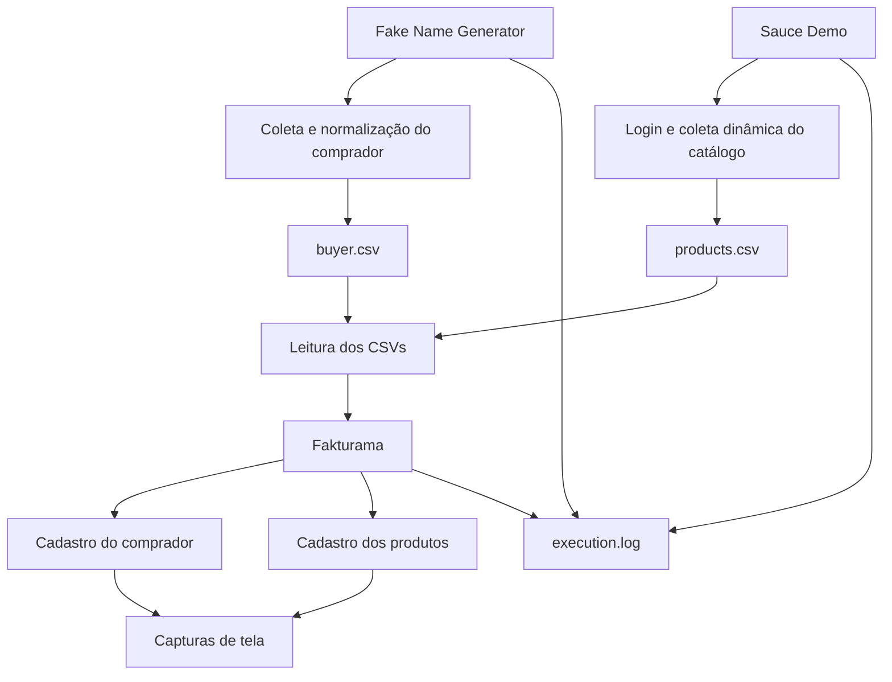
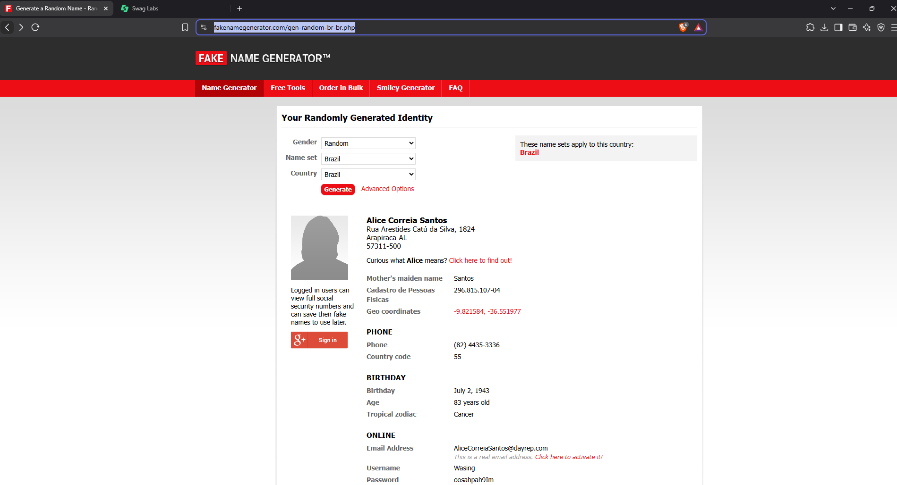
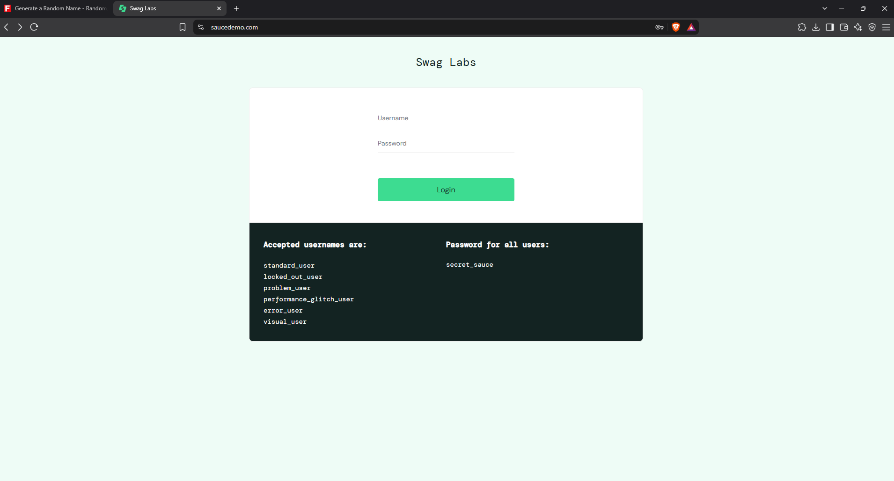
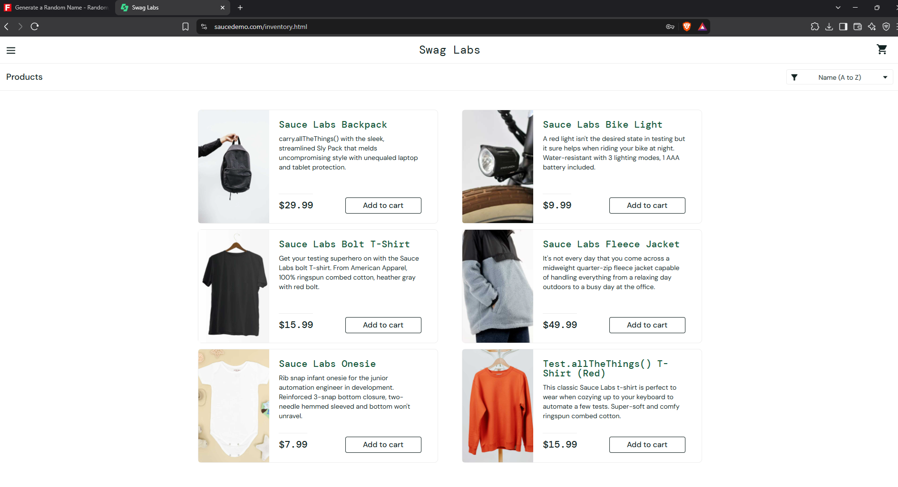
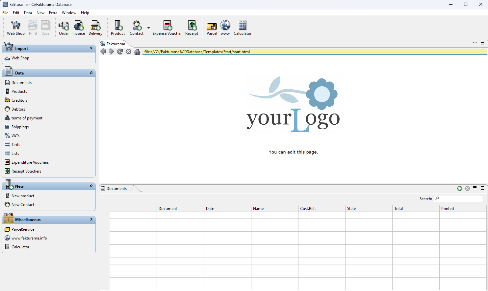
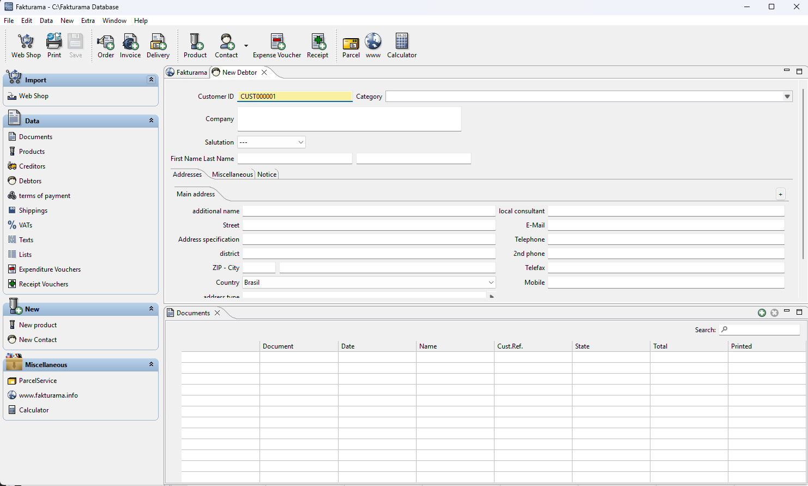
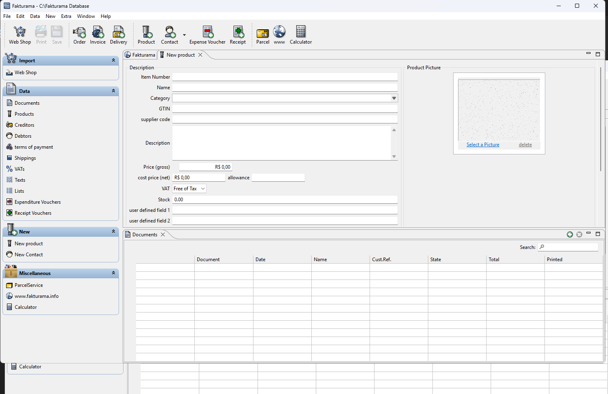

# Desafio RPA — Documento de Solução

Este documento registra o **desenho da solução** elaborado para o desafio e as principais decisões consolidadas durante a implementação.

O passo a passo de instalação e execução está no [`README.md`](../README.md).

## 1. Objetivo

Construir um fluxo RPA ponta a ponta que combine:

- automação web para coletar um comprador fictício brasileiro;
- automação web para autenticar no Sauce Demo e coletar o catálogo completo;
- persistência em CSV como ponte entre web e desktop;
- automação desktop para cadastrar comprador e produtos no Fakturama;
- logging e evidências suficientes para validar a execução.

Cada execução processa um comprador e todos os produtos encontrados dinamicamente no catálogo.

## 2. Fluxo



A leitura dos CSVs antes da etapa desktop é intencional: os arquivos persistidos são o contrato de dados entre as duas partes da automação.

## 3. Dados coletados

### Comprador

O Fake Name Generator fornece uma identidade brasileira fictícia. São persistidos:

- nome;
- sobrenome;
- rua;
- número;
- cidade;
- estado;
- CEP;
- CPF;
- telefone;
- data de nascimento.

No Fakturama, o desafio utiliza nome, sobrenome e CEP.

**Referência — dados gerados no Fake Name Generator:**



### Produtos

Para cada item do Sauce Demo são coletados:

- número do item;
- nome;
- descrição;
- preço.

A quantidade não é fixa e é determinada a partir do DOM em cada execução.

**Referência — login do Sauce Demo:**



**Referência — catálogo utilizado na coleta dinâmica:**



## 4. Número do item do Sauce Demo

A interface não exibe visualmente um código de produto. Durante o spike foi identificado um identificador estável no DOM:

```text
item_<numero>_title_link
```

A implementação extrai `<numero>` desse atributo. Exemplo:

```text
item_4_title_link -> 4
```

Se o padrão esperado não for encontrado, a coleta falha explicitamente em vez de gerar um identificador artificial.

## 5. Arquitetura

```text
rpa_challenge_fakturama/
├── main.py
├── .env.example
├── requirements.txt
├── pytest.ini
│
├── src/
│   ├── config/
│   │   └── settings.py
│   ├── core/
│   │   └── execution.py
│   ├── web/
│   │   ├── buyer_scraper.py
│   │   └── sauce_demo.py
│   ├── repositories/
│   │   └── csv_repository.py
│   └── desktop/
│       └── fakturama.py
│
├── resources/
│   └── images/
│       └── fakturama/
│
├── tests/
│   ├── integration/
│   ├── validation/
│   ├── test_buyer_parsing.py
│   ├── test_product_parsing.py
│   └── test_csv_repository.py
│
├── results/
├── spikes/
└── docs/
```

Responsabilidades:

- `main.py`: orquestra o fluxo.
- `src/config`: configuração de runtime.
- `src/web`: scraping e normalização.
- `src/repositories`: persistência e leitura dos CSVs.
- `src/desktop`: interação com Fakturama.
- `src/core`: diretórios de execução e logging.
- `resources`: imagens usadas como âncoras visuais.
- `spikes`: POC histórica, sem dependência do código de produção.

## 6. Configuração

Valores que podem variar entre máquina/ambiente ficam em variáveis de ambiente e são lidos por:

```text
src/config/settings.py
```

O `.env` é opcional e local. O repositório fornece `.env.example` com os valores esperados.

Seletores web, nomes de assets, headers CSV e demais regras internas permanecem nos respectivos módulos, evitando transformar a configuração em um repositório de constantes sem relação com ambiente.

## 7. Persistência

### `buyer.csv`

```csv
first_name,last_name,street,number,city,state,zip_code,cpf,phone,birth_date
Miguel,Pereira Carvalho,Rua Amadeu Natal,1199,Curitiba,PR,82650-440,160.419.191-01,(41) 6375-6640,1941-07-19
```

### `products.csv`

```csv
item_number,name,description,price
4,Sauce Labs Backpack,Descrição do produto,29.99
```

Os valores de preço permanecem normalizados com ponto no CSV. A conversão para vírgula ocorre apenas ao preencher o Fakturama.

## 8. Estratégia de automação desktop

O Fakturama é automatizado com reconhecimento de imagem e ações relativas às âncoras encontradas.

**Referência — tela principal do Fakturama:**



**Referência — formulário de novo comprador:**



**Referência — formulário de novo produto:**



Fluxo típico:

```text
aguardar âncora
    ↓
calcular posição do campo
    ↓
clicar
    ↓
validar visualmente o foco
    ↓
preencher
    ↓
salvar
```

Para evitar escrita em campos incorretos, os inputs destacados pelo Fakturama são validados pela cor de foco antes do preenchimento. A validação aceita tolerância de RGB e pode repetir o clique antes de falhar.

As esperas utilizam polling por imagem sempre que possível. Pequenos `sleep` permanecem apenas em pontos em que a interface precisa concluir uma transição curta ou preparar a evidência.

O preenchimento usa `pyperclip` + `Ctrl+V` pela velocidade, com o trade-off conhecido de sobrescrever o clipboard do usuário.

## 9. Logs e evidências

Cada execução recebe uma pasta própria:

```text
results/
└── YYYY-MM-DD_HHMMSS/
    ├── buyer.csv
    ├── products.csv
    ├── execution.log
    └── screenshots/
        ├── customer_registered.png
        ├── products_registered.png
        └── error.png
```

O log registra:

- início da execução e ambiente;
- comprador coletado;
- quantidade e identificação dos produtos;
- persistência e recarga dos CSVs;
- cadastro do comprador;
- cadastro produto a produto;
- caminhos das evidências;
- resumo final;
- exceção e traceback quando houver falha.

Existe uma execução de referência versionada em:

```text
results/2026-09-21_234913/
```

As demais execuções são artefatos de runtime e ficam ignoradas pelo Git.

## 10. Tratamento de falhas

O fluxo evita retentativas cegas em operações que podem gerar duplicidade.

Quando uma falha impede continuar com segurança:

1. a exceção é registrada;
2. uma screenshot de erro é tentada quando o Fakturama já está aberto;
3. o aplicativo é fechado no `finally`;
4. o resumo final registra a quantidade efetivamente cadastrada;
5. a exceção é propagada para que a execução termine como falha.

Falha ao fechar o Fakturama também invalida o status de sucesso.

## 11. Testes

A estratégia separa:

- **unitários**: parsing, normalização e persistência CSV;
- **integração**: Playwright + parsing + CSV com páginas controladas;
- **validação**: orquestração completa com dependências externas substituídas, incluindo sucesso, falha de cadastro e falha no fechamento.

A interface real do Fakturama não é executada automaticamente pela suíte para evitar testes frágeis dependentes de resolução, foco e estado do desktop. O fluxo desktop real é validado pela execução funcional e pelas evidências geradas.

## 12. Premissas e decisões de escopo

Premissas principais:

- execução desktop em Windows;
- Fakturama 2.2.0 instalado localmente;
- acesso aos dois sites utilizados;
- renderização do Fakturama compatível com as imagens de referência;
- ausência de interação manual com mouse/teclado durante a etapa desktop.

Ficam fora do escopo:

- criação de pedido ou fatura;
- associação do comprador a uma compra;
- banco de dados;
- OCR;
- execução distribuída;
- múltiplos compradores em uma mesma execução.

## 13. Critérios de sucesso

Uma execução é considerada bem-sucedida quando:

1. o comprador é coletado e persistido;
2. todos os produtos disponíveis são coletados e persistidos;
3. os CSVs são recarregados para a etapa desktop;
4. o comprador é cadastrado no Fakturama;
5. todos os produtos são cadastrados;
6. as evidências visuais são geradas;
7. o log registra o fluxo e o resumo final;
8. os dados persistidos correspondem aos utilizados no cadastro desktop.
