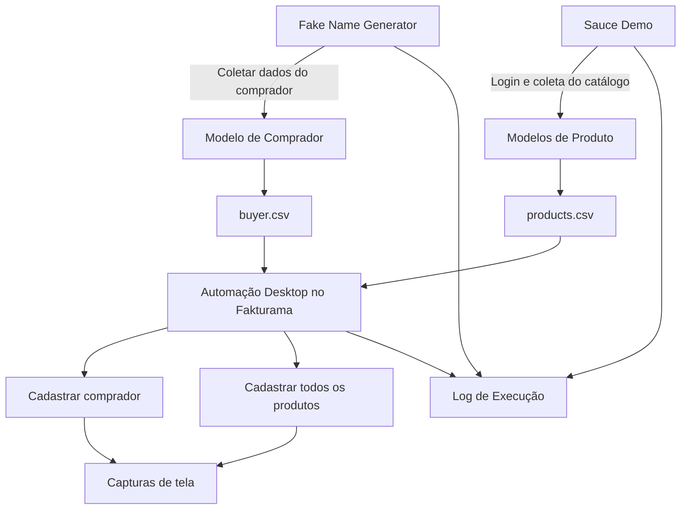

# Desafio RPA — Documento de Solução

## 1. Objetivo

Implementar um fluxo RPA ponta a ponta que combine:

- **Automação web** para coletar um comprador fictício brasileiro e o catálogo completo de produtos do Sauce Demo.
- **Persistência em CSV** como ponte de dados entre as etapas web e desktop.
- **Automação desktop** para cadastrar o comprador e os produtos coletados no Fakturama.
- **Evidências de execução** por meio de arquivos CSV, capturas de tela e um único log de execução.

A implementação deve permanecer simples, legível, reproduzível e fácil de manter.

---

## 2. Escopo

Cada execução processará:

- **1 comprador fictício**
- **Todos os produtos disponíveis no catálogo do Sauce Demo**
- **1 cadastro de contato** no Fakturama
- **1 cadastro de produto para cada item coletado do catálogo**

O desafio não exige a criação de pedido, fatura ou relacionamento entre o comprador e os produtos.

---

## 3. Fluxo do Processo



Os arquivos CSV separam intencionalmente a etapa de coleta web da etapa de cadastro desktop.

---

## 4. Aplicações

### 4.1 Fake Name Generator

URL:

```text
https://www.fakenamegenerator.com/gen-random-br-br.php
```

Ao abrir essa URL, uma identidade brasileira fictícia já é gerada.

Dados coletados e persistidos:

- Nome
- Sobrenome
- Rua
- Número
- Cidade
- Estado
- CEP
- CPF
- Telefone
- Data de nascimento

Para o cadastro desktop atualmente implementado no Fakturama, são utilizados
nome, sobrenome e CEP.

Exemplo de tela:


---

### 4.2 Sauce Demo — Login

URL:

```text
https://www.saucedemo.com/
```

O login será automatizado usando Playwright e as credenciais de teste documentadas na própria página.

Exemplo de tela:


---

### 4.3 Sauce Demo — Catálogo de Produtos

Após a autenticação, a automação coletará todos os produtos disponíveis na página de inventário.

Para cada produto:

- Número do item
- Nome
- Descrição
- Preço

Exemplo de tela:


A implementação **não deve assumir uma quantidade fixa de produtos**. O número de itens será determinado dinamicamente a partir da página.

---

### 4.4 Fakturama — Tela Inicial

O Fakturama é a aplicação desktop utilizada para cadastrar os dados coletados.

Exemplo de tela:


A automação desktop usará reconhecimento de imagem para localizar âncoras visuais estáveis e navegação por teclado sempre que possível.

---

### 4.5 Fakturama — Novo Contato

O comprador coletado no Fake Name Generator será cadastrado como um novo contato.

Campos relevantes para este desafio:

- Nome
- Sobrenome
- CEP

Exemplo de tela:


---

### 4.6 Fakturama — Novo Produto

Cada produto coletado no Sauce Demo será cadastrado como um novo produto.

Campos relevantes:

- Número do item
- Nome
- Descrição
- Preço

Exemplo de tela:


---

## 5. Stack Técnica Proposta

### Automação web

- Python 3
- Playwright

### Automação desktop

- PyAutoGUI
- OpenCV para suporte ao reconhecimento de imagem

### Persistência e infraestrutura

- `csv` do Python
- `logging` do Python
- `pathlib` do Python
- `subprocess` do Python
- `dataclasses`
- `pytest`

A solução evita frameworks adicionais, a menos que tragam valor claro para o desafio.

---

## 6. Estrutura Geral do Projeto

```text
rpa_challenge_fakturama/
├── README.md
├── requirements.txt
├── pytest.ini
├── .gitignore
├── main.py
│
├── src/
│   ├── web/
│   │   ├── buyer_scraper.py
│   │   └── sauce_demo.py
│   ├── desktop/
│   │   └── fakturama.py
│   └── repositories/
│       └── csv_repository.py
│
├── resources/
│   └── images/
│       └── fakturama/
│
├── spikes/
│   ├── README.md
│   └── poc.py
│
├── tests/
│   ├── conftest.py
│   ├── test_buyer_parsing.py
│   ├── test_product_parsing.py
│   └── test_csv_repository.py
│
├── docs/
│   ├── desafio_tecnico_rpa_candidato.pdf
│   ├── documento_solucao.md
│   └── images/
│
└── results/
    └── .gitkeep
```

A estrutura poderá ser simplificada durante a implementação caso um desenho menor se mostre suficiente.

---

## 7. Contratos de Dados

### 7.1 CSV do Comprador

Exemplo:

```csv
first_name,last_name,street,number,city,state,zip_code,cpf,phone,birth_date
Miguel,Pereira Carvalho,Rua Amadeu Natal,1199,Curitiba,PR,82650-440,160.419.191-01,(41) 6375-6640,1941-07-19
```

Os dados adicionais do comprador são persistidos para tornar o handoff entre
as etapas web e desktop mais completo, mesmo que apenas um subconjunto seja
necessário no cadastro atual do Fakturama.

### 7.2 CSV de Produtos

Exemplo:

```csv
item_number,name,description,price
1,Sauce Labs Backpack,"carry.allTheThings() with the sleek, streamlined Sly Pack...",29.99
```

A automação persistirá todos os produtos encontrados na página.

---

## 8. Decisão sobre o Número do Item

O desafio exige um **número do item**, porém a interface do Sauce Demo não exibe visualmente um número de produto.

Durante o spike técnico, o DOM será inspecionado em busca de um identificador estável associado a cada produto.

Ordem de decisão:

1. Utilizar um identificador estável já disponível no DOM, caso exista.
2. Caso contrário, gerar um número sequencial determinístico com base na ordem dos produtos retornados pela página.
3. Documentar a estratégia adotada no README.

Nenhum identificador aleatório será gerado.

---

## 9. Estratégia de Automação Desktop

O fluxo desktop priorizará:

```text
Reconhecimento de imagem
    ↓
Localizar uma âncora visual estável
    ↓
Clicar/focar a tela
    ↓
Navegar usando atalhos de teclado / TAB
    ↓
Preencher os valores necessários
    ↓
Salvar
```

O reconhecimento de imagem será usado somente onde agregar valor.

A automação deve evitar localizar cada campo individualmente por imagem quando a navegação por teclado for suficiente.

Exemplo de abstração:

```python
desktop.find_and_click("new_contact.png")
desktop.write(buyer.first_name)
desktop.press("tab")
desktop.write(buyer.last_name)
```

Isso mantém o fluxo do Fakturama legível e reduz chamadas duplicadas ao PyAutoGUI.

---

## 10. Sincronização

Atrasos fixos não devem ser a principal estratégia de sincronização.

Em vez de depender de:

```python
time.sleep(5)
```

a camada desktop deve aguardar um estado visual esperado:

```python
wait_for_image(
    image_path="new_product.png",
    timeout=10,
    confidence=0.85,
)
```

Pequenos intervalos internos de polling ainda podem ser utilizados durante a espera pelo estado esperado.

---

## 11. Estratégia de Retentativas

As retentativas serão aplicadas somente quando a operação puder ser repetida com segurança.

### Exemplos seguros para retentativa

- Abrir uma URL
- Aguardar um seletor web
- Aguardar uma imagem no desktop
- Localizar uma âncora visual
- Abrir uma tela que não persista dados

### Operações que exigem cuidado

- Salvar um contato
- Salvar um produto

Uma retentativa cega após uma operação de persistência pode criar registros duplicados.

Para operações de escrita, a automação deve primeiro determinar se a operação foi concluída com sucesso. Caso o estado final não possa ser identificado com segurança, o comportamento mais seguro será:

1. Capturar evidência
2. Registrar o erro no log
3. Interromper a execução

Configuração sugerida:

```python
MAX_RETRIES = 3
DEFAULT_TIMEOUT = 10
IMAGE_CONFIDENCE = 0.85
```

As retentativas devem tratar falhas transitórias, e não ocultar defeitos.

---

## 12. Estratégia de Logs

Será gerado **um único arquivo de log por execução completa do RPA**.

Exemplo:

```text
2026-09-21 21:30:00 | INFO  | Execução iniciada
2026-09-21 21:30:03 | INFO  | Comprador coletado: Alice Correia Santos
2026-09-21 21:30:03 | INFO  | Comprador persistido em buyer.csv

2026-09-21 21:30:05 | INFO  | Login no SauceDemo iniciado
2026-09-21 21:30:07 | INFO  | Login no SauceDemo realizado com sucesso
2026-09-21 21:30:08 | INFO  | Produtos encontrados: 6
2026-09-21 21:30:08 | INFO  | Produto [1/6] coletado: Sauce Labs Backpack

2026-09-21 21:31:00 | INFO  | Cadastro do cliente no Fakturama iniciado
2026-09-21 21:31:08 | INFO  | Cliente cadastrado com sucesso

2026-09-21 21:31:12 | INFO  | Cadastro do produto [1/6] iniciado
2026-09-21 21:31:19 | INFO  | Produto [1/6] cadastrado com sucesso

2026-09-21 21:33:42 | INFO  | Execução finalizada com sucesso
2026-09-21 21:33:42 | INFO  | Compradores cadastrados: 1/1
2026-09-21 21:33:42 | INFO  | Produtos cadastrados: 6/6
```

A implementação final não deve assumir que o catálogo sempre contém seis produtos; esse número é apenas ilustrativo.

---

## 13. Resultados e Evidências

Cada execução deve gerar sua própria pasta de resultados.

Exemplo:

```text
results/
└── 2026-09-21_213000/
    ├── buyer.csv
    ├── products.csv
    ├── execution.log
    └── screenshots/
        ├── customer_registered.png
        └── products_registered.png
```

Isso mantém agrupadas todas as evidências de uma mesma execução.

Evidências obrigatórias:

- CSV do comprador
- CSV do catálogo de produtos
- Captura de tela mostrando o comprador cadastrado
- Captura de tela mostrando a lista completa de produtos cadastrados
- Log de execução

---

## 14. Tratamento de Erros

Os erros devem ser registrados com informações suficientes para identificar:

- Em qual etapa ocorreu a falha
- Qual item estava sendo processado
- Qual tentativa estava em execução
- A exceção original
- Se a execução pode continuar com segurança

Quando relevante, uma captura de tela deve ser gerada antes da interrupção.

Exemplo:

```text
ERROR | Falha ao cadastrar produto [3/6]
ERROR | Produto atual: Sauce Labs Bolt T-Shirt
ERROR | Imagem esperada não encontrada: save_confirmation.png
ERROR | Screenshot salvo em: screenshots/error_product_3.png
```

---

## 15. Testes

Os testes priorizarão primeiro a lógica determinística.

### Testes unitários

Exemplos:

- Interpretar dados do comprador
- Interpretar preço do produto
- Criar modelos de produto
- Gravar arquivos CSV
- Ler arquivos CSV
- Validar campos obrigatórios
- Validar quantidade de produtos

### Testes de integração / smoke

Exemplos:

- Scraping do Fake Name Generator
- Login e scraping do Sauce Demo
- Handoff por CSV
- Interação desktop básica

Chamadas de baixo nível como `pyautogui.click()` não precisam de testes unitários artificiais.

---

## 16. Configuração

A configuração deve permanecer pequena e explícita.

Exemplo:

```python
FAKE_NAME_URL = "https://www.fakenamegenerator.com/gen-random-br-br.php"

SAUCE_URL = "https://www.saucedemo.com/"
SAUCE_USERNAME = "standard_user"
SAUCE_PASSWORD = "secret_sauce"

FAKTURAMA_PATH = "..."

MAX_RETRIES = 3
DEFAULT_TIMEOUT = 10
IMAGE_CONFIDENCE = 0.85
```

O desafio exige um comprador fictício por execução, portanto a quantidade de compradores não será configurável, a menos que um requisito posterior justifique isso.

---

## 17. Premissas

A implementação inicial considera:

- Ambiente Windows
- Fakturama instalado localmente
- Fakturama iniciado a partir de uma versão/configuração conhecida
- Escala de exibição e resolução compatíveis com as imagens de referência capturadas
- Acesso à internet disponível
- Sauce Demo e Fake Name Generator acessíveis
- O avaliador poderá configurar o caminho do executável do Fakturama, se necessário

O README final documentará o ambiente utilizado durante desenvolvimento e validação.

---

## 18. Fora do Escopo

Os seguintes itens ficam intencionalmente fora do escopo do desafio, a menos que posteriormente sejam exigidos:

- Criar faturas
- Criar pedidos
- Associar o comprador a uma compra
- Cadastrar múltiplos compradores em uma mesma execução
- Orquestração externa
- Integração com banco de dados
- OCR
- Frameworks complexos de interface
- Execução distribuída

---

## 19. Critérios de Sucesso

A execução será considerada bem-sucedida quando:

1. Um comprador fictício for coletado.
2. Todos os produtos disponíveis no Sauce Demo forem coletados.
3. Os dados do comprador forem persistidos em CSV.
4. Os dados dos produtos forem persistidos em CSV.
5. O comprador for cadastrado no Fakturama.
6. Todos os produtos coletados forem cadastrados no Fakturama.
7. Os dados dos CSVs e os registros do Fakturama coincidirem.
8. As capturas de tela obrigatórias forem geradas.
9. O log de execução registrar o processo item a item.
10. Um segundo desenvolvedor conseguir clonar o repositório, seguir o README, configurar o ambiente e executar a automação sem precisar conhecer a implementação.

---

## 20. Plano Inicial de Implementação

Evolução planejada do repositório:

```text
docs: add challenge requirements and initial solution design

spike: validate web and desktop automation feasibility (poc)

test: add unit tests for parsing and csv persistence

feat: implement fake customer scraping

feat: implement SauceDemo product scraping

feat: add csv persistence layer

feat: implement Fakturama customer registration

feat: implement Fakturama product registration

feat: add execution logging and evidence capture

test: add integration and validation scenarios

docs: add setup and execution instructions
```

A sequência poderá mudar caso o spike técnico revele alguma restrição na automação desktop.
